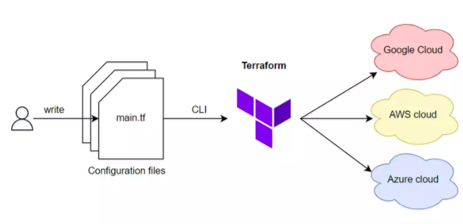
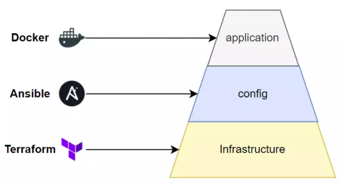
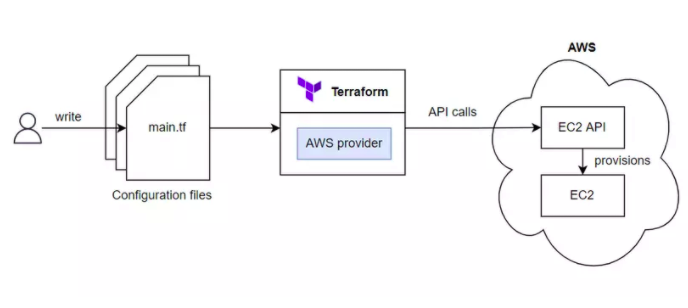
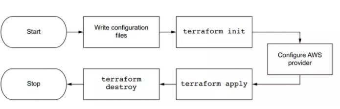
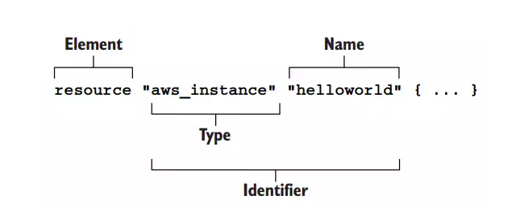
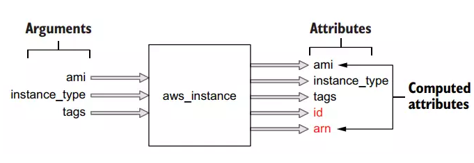

Infrastructure as Code
----------------------

Từ cái tên của Infrastructure as Code thì ta có thể hiểu đơn giản là ta sẽ viết code để mô tả và cung cấp (provisioning) infrastructure của chúng ta 😁. Từ Infrastructure tiếng việt có nghĩa là hạ tầng, còn ở trong ngành IT của chúng ta thì mình hiểu nó là hạ tầng của hệ thống, bao gồm máy chủ, mạng, gateway, database, tất cả những thứ cần thiết để triển khai ứng dụng của chúng ta trên môi trường server. Infrastructure as Code thì chắc có lẽ được sử dụng phổ biến nhất trên môi trường Cloud.

Ví dụ ở trên AWS Cloud, bình thường thì ta sẽ đăng nhập lên web console, rồi ta cần máy ảo thì ta thao tác trên web để tạo máy ảo (EC2), ta cần database thì ta sẽ thao tác trên web để tạo database. Và từ từ thì hạ tầng hệ thống của chúng sẽ phình to ra, đây là lúc ta sẽ gặp vấn đề, ta sẽ không biết hệ thống hiện tại ta đang có những gì, cho dù ta có nhớ đi nữa thì lỡ người quản lý cloud đó nghỉ việc, người mới vào sẽ làm sao biết được hạ tầng hiện tại? Ngoài ra, nếu lỡ có ai đó xóa EC2 của ta thì sao, ta phải tạo lại nó bằng tay, mà ta đâu biết là thằng EC2 lúc trước nó tạo ra với config thế nào, cho dù có docs đi nữa thì việc tạo lại rất mất thời gian. Và nếu lỡ nguyên hạ tầng cloud nó down luôn thì sao, không lẻ ta phải tạo lại nguyên cái hạ tầng hệ thống từ đầu? Thì IaC sẽ giúp ta giải quyết những vấn trên, ta sẽ viết những file để describe và backup lại hạ tầng của chúng ta, nếu có việc gì xảy ra như nguyên hạ tầng down hoặc ai đó sửa gì sai trên hạ tầng của ta thì ta có thể dễ dàng triển khai nó lại một cách dễ dàng.

**Terraform**
---------

Thì trong mảng IaC này thì tool mà thông dụng nhất ở thời điểm hiện tại chắc có lẽ là Terraform. Terraform là một open-source của HashiCorp, chuyên dùng để provisioning infrastructure, ta chỉ việc viết code, rồi gõ một vài câu CLI đơn giản, nó sẽ tạo ra Infrastructure cho ta, thay vì ta với lên web console bấm bấm rất tốn thời gian.

Flow của terraform sẽ như sau, ta viết code, xong ta gõ câu lệnh CLI, và đợi nó cung cấp infrastructure, sau khi nó tạo xong thì nó sẽ tạo ra một file state để lưu lại kiến trúc hạ tầng hiện tại của ta.
  

Thì cũng có nhiều tool khác có thể làm được việc này như là Ansible chẳng hạn, nhưng thằng Ansible nó là một Configuration Management tool chứ nó không phải được tạo ra để tập trung cho mảng IaC, nên ta dùng nó thì sẽ tốn công chạy những thứ không cần thiết 😁.

Để triển khai một ứng dụng thì ta có thể làm nguyên flow sau đây, dùng Terraform để tạo hạ tầng, sau đó dùng Ansible để setup những thứ cần thiết cho server, như install docker chẳng hạn, setup CI tool trên server. Sau đó thì ta dùng docker hoặc kubernetes để chạy ứng dụng của ta.
  

**Tại sao nên dùng Terraform**
Đây là 4 điểm lợi của Terraform so với các công cụ khác:

Dễ xài.
Open source và miễn phí.
Declarative programing: chỉ diễn tả những thứ bạn cần và Terraform làm cho bạn.
Có thể cung cấp hạ tầng cho nhiều cloud khác nhau như AWS, GCP, Azure trong cùng một file cấu hình, này ta gọi là Cloud-agnostic.
Tới đây thì ta nói nhiều rồi, giờ sẽ làm một ví dụ nhỏ để ta hiểu hơn. Trong series này mình sẽ dùng Terraform để provisioning hạ tầng trên AWS (tại mấy cloud cái khác mình chưa xài 😂).

Và để làm được thì yêu cầu là bạn phải có tài khoản AWS nhé, và ta tạo một IAM user và cho nó admin premission, xong ta lấy access key của nó config vào máy ta nhé. Tạo một file ở đường dẫn ~/.aws/credentials với nội dung sau:
```
[default]
aws_access_key_id=<your-key>
aws_secret_access_key=<your-key>
```

**Hướng dẫn cài đặt Terraform**
- https://learn.hashicorp.com/tutorials/terraform/install-cli.

**“Hello Terraform!”**
Ở bài ví dụ này ta sẽ dùng Terraform để tạo một EC2 trên AWS Cloud, ngôn ngữ Terraform sử dụng gọi là HashiCorp Configuration Language (HCL).

  
Các bước ta thực hiện như sau:

1.  Viết terraform file.
2.  Cấu hình AWS provider.
3.  Khỏi tạo Terraform bằng câu lệnh `terraform init`.
4.  Triển khai EC2 instance bằng câu lệnh `terraform apply`.
5.  Xóa EC2 bằng câu lệnh `terraform destroy`.

 

Tạo một file tên là main.tf và ta gõ đoạn code sau đây:
```
provider "aws" {
  region = "us-west-2"
}
```
Đây là ta sẽ chỉ định ta sử dụng aws provider, và resource của chúng ta sẽ được tạo ở region là us-west-2. Sau đó ta thêm vào đoạn code để mô tả EC2 của chúng ta:
```
provider "aws" {
  region = "us-west-2"
}

resource "aws_instance" "hello" {
  ami           = "ami-09dd2e08d601bff67"
  instance_type = "t2.micro"
  tags = {
    Name = "HelloWorld"
  }
}
```
- Ở trên ta sử dụng một block tên là resources, đây là block quan trọng nhất của terraform, ta sẽ sử dụng block này để tạo resource của chúng ta. Phía sau resources thì ta sẽ có thêm giá trị nữa là resource type mà ta muốn tạo (cái này phụ thuộc vào provider của chúng ta sẽ cung cấp những resource type nào) , ở trên resource type của ta là aws_instance, và giá trị cuối cùng là tên của resource đó, này ta muốn đặt gì cũng được.
 
- Để xem những thuộc tính của một resource nào đó, ta lên trang https://registry.terraform.io/ để xem. Ví dụ ở đây mình cần xem thuộc tính của aws_instance thuộc aws provider.
- Mỗi resource của chúng ta sẽ có giá trị arguments (đầu vào) và attributes (đầu ra) tùy thuộc vào resource type, và attributes sẽ có loại gọi là computed attributes, là những attributes ta chỉ biết được khi resource đã được tạo ra.
 
- Xong khi ta viết config xong hết, thì ta mở terrminal lên và gõ terraform init, bước này là bắt buộc khi ta viết một cấu hình cho một hạ tầng mới, nó sẽ tải code của provider xuống folder hiện tại mà ta viết file main.tf.
```
$ terraform init
Initializing the backend...

Initializing provider plugins...
- Finding latest version of hashicorp/aws...
- Installing hashicorp/aws v3.66.0...
- Installed hashicorp/aws v3.66.0 (signed by HashiCorp)

Terraform has created a lock file .terraform.lock.hcl to record the provider
selections it made above. Include this file in your version control repository
so that Terraform can guarantee to make the same selections by default when
you run "terraform init" in the future.
```
Sau khi init xong, ta gõ tiếp câu lệnh apply để nó tạo EC2 cho ta.

```
$ terraform apply -auto-approve
Terraform used the selected providers to generate the following execution plan. Resource actions are indicated with the
following symbols:
  + create

Terraform will perform the following actions:

  # aws_instance.hello will be created
  + resource "aws_instance" "hello" {
      + ami                                  = "ami-09dd2e08d601bff67"
...
Plan: 1 to add, 0 to change, 0 to destroy.
aws_instance.hello: Creating...
aws_instance.hello: Still creating... [10s elapsed]
aws_instance.hello: Still creating... [20s elapsed]
...
Apply complete! Resources: 1 added, 0 changed, 0 destroyed.
```
Bây giờ nếu ta muốn xóa EC2 đi, ta chỉ cần chạy câu lệnh destroy.
```
$ terraform destroy -auto-approve
aws_instance.hello: Refreshing state... [id=i-0ec68130272c45152]

Terraform used the selected providers to generate the following execution plan. Resource actions are indicated with the
following symbols:
  - destroy

Terraform will perform the following actions:

  # aws_instance.hello will be destroyed
  - resource "aws_instance" "hello" {
      - ami                                  = "ami-09dd2e08d601bff67" -> null
...
Plan: 0 to add, 0 to change, 1 to destroy.
aws_instance.hello: Destroying... [id=i-0ec68130272c45152]
aws_instance.hello: Still destroying... [id=i-0ec68130272c45152, 10s elapsed]
aws_instance.hello: Still destroying... [id=i-0ec68130272c45152, 20s elapsed]
aws_instance.hello: Still destroying... [id=i-0ec68130272c45152, 30s elapsed]
aws_instance.hello: Destruction complete after 35s

Destroy complete! Resources: 1 destroyed.
```

**Kết luận**
Vậy là ta đã tìm hiểu xong về IaC là gì và Terraform sử dụng như thế nào. Như bạn thấy thì với Terraform, ta tạo và xóa resource đi một cách rất dễ dàng. Nếu có thắc mắc hoặc cần giải thích rõ thêm chỗ nào thì các bạn có thể hỏi dưới phần comment. Bài tiếp theo mình sẽ nói sâu hơn về cách viết file config và life cycle của Terraform khi nó tạo resoruce, mong các bạn theo dõi series của mình nhé.

