Tiếp tục ví dụ đơn giản ở bài trước là ta sẽ provisioning một EC2 trên AWS Cloud. Để provisioning infrastructure mới, ta sẽ làm theo các bước sau đây. Tạo workspace => viết config file => khởi tạo workspace với terraform init => kiểm tra resrource nào sẽ được tạo ra với terraform plan => tạo resource với terraform apply.

  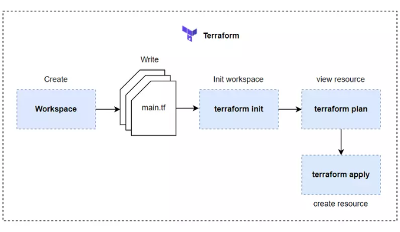
Provisioning infrastructure
===========================

Tạo workspace và viết config
----------------------------

Đầu tiên ta sẽ tạo một workspace, đơn giản là tạo một folder thôi. Tạo một folder tên là ec2 và mở nó folder ra, ta tạo một file tên là `main.tf` (này bạn đặt tên gì cũng được). Dán đoạn code ở bài trước vào.

    provider "aws" {
      region = "us-west-2"
    }
    
    resource "aws_instance" "hello" {
      ami           = "ami-09dd2e08d601bff67"
      instance_type = "t2.micro"
      tags = {
        Name = "HelloWorld"
      }
    }
    

Sau khi ta viết config xong, ta chạy câu lệnh terraform init, để nó tải aws provider xuống folder hiện tại để Terraform có thể sử dụng những provider này và gọi API lên AWS để tạo resource cho ta. Về syntax và ý nghĩa của syntax trong file terraform trên thì các bạn xem ở bài trước nhé.

Khởi tạo workspace
------------------

    $ terraform init
    Initializing the backend...
    
    Initializing provider plugins...
    - Finding latest version of hashicorp/aws...
    - Installing hashicorp/aws v3.68.0...
    - Installed hashicorp/aws v3.68.0 (signed by HashiCorp)
    
    Terraform has created a lock file .terraform.lock.hcl to record the provider
    selections it made above. Include this file in your version control repository
    so that Terraform can guarantee to make the same selections by default when
    you run "terraform init" in the future.
    ...
    

Sau khi bạn chạy câu lệnh init xong, bạn sẽ thấy có một folder tên là `.terraform` được tạo ra, đây là folder chứa code của provider. Cấu trúc folder sau khi ta chạy câu lệnh init.

    ├── .terraform
    │   └── providers
    │       └── registry.terraform.io
    │           └── hashicorp
    │               └── aws
    │                   └── 3.68.0
    │                       └── linux_amd64
    │                           └── terraform-provider-aws_v3.68.0_x5
    ├── .terraform.lock.hcl
    └── main.tf
    

Kiểm tra resrource nào sẽ được tạo ra
-------------------------------------

Sau khi khởi tạo workspace xong, thì trước khi ta tạo resource thực tế, ta cần review qua trước là những resrource nào sẽ được tạo, bước này thì không bắt buộc. Nhưng để kĩ càng, thì khi làm ta cứ chạy qua bước này, để kiểm tra resource sẽ ra sao trước khi ta tạo nó trên hạ tầng thực sự của ta. Để kiểm tra resrource, ta chạy câu lệnh terraform plan.

    $ terraform plan
    Terraform used the selected providers to generate the following execution plan. Resource actions are indicated with the
    following symbols:
      + create
    
    Terraform will perform the following actions:
    
      # aws_instance.hello will be created
      + resource "aws_instance" "hello" {
          + ami                                  = "ami-09dd2e08d601bff67"
          + arn                                  = (known after apply)
          + associate_public_ip_address          = (known after apply)
          + availability_zone                    = (known after apply)
          + cpu_core_count                       = (known after apply)
          + cpu_threads_per_core                 = (known after apply)
          + disable_api_termination              = (known after apply)
          + ebs_optimized                        = (known after apply)
          + get_password_data                    = false
          + host_id                              = (known after apply)
          + id                                   = (known after apply)
          + instance_initiated_shutdown_behavior = (known after apply)
          + instance_state                       = (known after apply)
          + instance_type                        = "t2.micro"
          + ipv6_address_count                   = (known after apply)
          + ipv6_addresses                       = (known after apply)
          + key_name                             = (known after apply)
          + monitoring                           = (known after apply)
          + outpost_arn                          = (known after apply)
          + password_data                        = (known after apply)
          + placement_group                      = (known after apply)
          + placement_partition_number           = (known after apply)
          + primary_network_interface_id         = (known after apply)
          + private_dns                          = (known after apply)
          + private_ip                           = (known after apply)
          + public_dns                           = (known after apply)
          + public_ip                            = (known after apply)
          + secondary_private_ips                = (known after apply)
          + security_groups                      = (known after apply)
          + source_dest_check                    = true
          + subnet_id                            = (known after apply)
          + tags                                 = {
              + "Name" = "HelloWorld"
            }
          + tags_all                             = {
              + "Name" = "HelloWorld"
            }
          + tenancy                              = (known after apply)
          + user_data                            = (known after apply)
          + user_data_base64                     = (known after apply)
          + vpc_security_group_ids               = (known after apply)
    
          + capacity_reservation_specification {
              + capacity_reservation_preference = (known after apply)
    
              + capacity_reservation_target {
                  + capacity_reservation_id = (known after apply)
                }
            }
    
          + ebs_block_device {
              + delete_on_termination = (known after apply)
              + device_name           = (known after apply)
              + encrypted             = (known after apply)
              + iops                  = (known after apply)
              + kms_key_id            = (known after apply)
              + snapshot_id           = (known after apply)
              + tags                  = (known after apply)
              + throughput            = (known after apply)
              + volume_id             = (known after apply)
              + volume_size           = (known after apply)
              + volume_type           = (known after apply)
            }
    
          + enclave_options {
              + enabled = (known after apply)
            }
    
          + ephemeral_block_device {
              + device_name  = (known after apply)
              + no_device    = (known after apply)
              + virtual_name = (known after apply)
            }
    
          + metadata_options {
              + http_endpoint               = (known after apply)
              + http_put_response_hop_limit = (known after apply)
              + http_tokens                 = (known after apply)
            }
    
          + network_interface {
              + delete_on_termination = (known after apply)
              + device_index          = (known after apply)
              + network_interface_id  = (known after apply)
            }
    
          + root_block_device {
              + delete_on_termination = (known after apply)
              + device_name           = (known after apply)
              + encrypted             = (known after apply)
              + iops                  = (known after apply)
              + kms_key_id            = (known after apply)
              + tags                  = (known after apply)
              + throughput            = (known after apply)
              + volume_id             = (known after apply)
              + volume_size           = (known after apply)
              + volume_type           = (known after apply)
            }
        }
    
    Plan: 1 to add, 0 to change, 0 to destroy.
    
    ───────────────────────────────────────────────────────────────────────────────────────────────────────────────────────────
    
    Note: You didn't use the -out option to save this plan, so Terraform can't guarantee to take exactly these actions if you
    run "terraform apply" now.
    

Khi bạn chạy câu lệnh plan trên thì nó sẽ hiển thị ra cho bạn những resouce nào sẽ được tạo, ở dòng hiển thị gần cuối bạn sẽ thấy là `Plan: 1 to add, 0 to change, 0 to destroy.`, nghĩa là sẽ có 1 resource được thêm vào infrastructure hiện tại của ta.

Ngoài việc hiển thị những resource sẽ được tạo, câu lệnh này cũng sẽ kiểm tra lỗi syntax của file terraform config của ta và sẽ báo lỗi nếu ta không viết đúng syntax.

> Khi có quá nhiều resource và câu lệnh plan bị chậm, ta có thể tăng tốc nó lên bằng việc thêm vào **\-parallelism=n**. Ví dụ như sau: `terraform plan -parallelism=2`

Nếu bạn cần lưu lại kết quả của câu lệnh plan, bạn sử dụng thêm -out option khi chạy. Ví dụ ta sẽ save lại kết quả của câu lệnh plan trong file json.

    $ terraform plan -out plan.out
    $ terraform show -json plan.out > plan.json
    

Tạo resource
------------

Sau khi ta kiểm tra resource xong, thì để tạo ta chạy câu lệnh apply.

    $ terraform apply
    Terraform used the selected providers to generate the following execution plan. Resource actions are indicated with the
    following symbols:
      + create
    
    Terraform will perform the following actions:
    
      # aws_instance.hello will be created
      + resource "aws_instance" "hello" {
          + ami                                  = "ami-09dd2e08d601bff67"
          + arn                                  = (known after apply)
          + associate_public_ip_address          = (known after apply)
          + availability_zone                    = (known after apply)
          + cpu_core_count                       = (known after apply)
          + cpu_threads_per_core                 = (known after apply)
          + disable_api_termination              = (known after apply)
          + ebs_optimized                        = (known after apply)
          + get_password_data                    = false
          + host_id                              = (known after apply)
          + id                                   = (known after apply)
          + instance_initiated_shutdown_behavior = (known after apply)
          + instance_state                       = (known after apply)
          + instance_type                        = "t2.micro"
          + ipv6_address_count                   = (known after apply)
          + ipv6_addresses                       = (known after apply)
          + key_name                             = (known after apply)
          + monitoring                           = (known after apply)
          + outpost_arn                          = (known after apply)
          + password_data                        = (known after apply)
          + placement_group                      = (known after apply)
          + placement_partition_number           = (known after apply)
          + primary_network_interface_id         = (known after apply)
          + private_dns                          = (known after apply)
          + private_ip                           = (known after apply)
          + public_dns                           = (known after apply)
          + public_ip                            = (known after apply)
          + secondary_private_ips                = (known after apply)
          + security_groups                      = (known after apply)
          + source_dest_check                    = true
          + subnet_id                            = (known after apply)
          + tags                                 = {
              + "Name" = "HelloWorld"
            }
          + tags_all                             = {
              + "Name" = "HelloWorld"
            }
          + tenancy                              = (known after apply)
          + user_data                            = (known after apply)
          + user_data_base64                     = (known after apply)
          + vpc_security_group_ids               = (known after apply)
    
          + capacity_reservation_specification {
              + capacity_reservation_preference = (known after apply)
    
              + capacity_reservation_target {
                  + capacity_reservation_id = (known after apply)
                }
            }
    
          + ebs_block_device {
              + delete_on_termination = (known after apply)
              + device_name           = (known after apply)
              + encrypted             = (known after apply)
              + iops                  = (known after apply)
              + kms_key_id            = (known after apply)
              + snapshot_id           = (known after apply)
              + tags                  = (known after apply)
              + throughput            = (known after apply)
              + volume_id             = (known after apply)
              + volume_size           = (known after apply)
              + volume_type           = (known after apply)
            }
    
          + enclave_options {
              + enabled = (known after apply)
            }
    
          + ephemeral_block_device {
              + device_name  = (known after apply)
              + no_device    = (known after apply)
              + virtual_name = (known after apply)
            }
    
          + metadata_options {
              + http_endpoint               = (known after apply)
              + http_put_response_hop_limit = (known after apply)
              + http_tokens                 = (known after apply)
            }
    
          + network_interface {
              + delete_on_termination = (known after apply)
              + device_index          = (known after apply)
              + network_interface_id  = (known after apply)
            }
    
          + root_block_device {
              + delete_on_termination = (known after apply)
              + device_name           = (known after apply)
              + encrypted             = (known after apply)
              + iops                  = (known after apply)
              + kms_key_id            = (known after apply)
              + tags                  = (known after apply)
              + throughput            = (known after apply)
              + volume_id             = (known after apply)
              + volume_size           = (known after apply)
              + volume_type           = (known after apply)
            }
        }
    
    Plan: 1 to add, 0 to change, 0 to destroy.
    
    Do you want to perform these actions?
      Terraform will perform the actions described above.
      Only 'yes' will be accepted to approve.
    
      Enter a value:
    

Khi ta chạy câu lệnh apply, thì terraform sẽ chạy câu lệnh plan lại trước, cho ta review resource, và nó sẽ hiện chỗ để hỏi ta là có muốn tạo những resource này không, nếu có thì bạn nhập `'yes'`, chỉ khi ta nhập đúng giá trị này thì resource của ta mới được tạo ra.

Nếu bạn thấy ủa sao câu lệnh apply cũng chạy plan, thì ta chạy câu lệnh plan trước làm quái gì cho mệt vậy? Thì thật ra những câu lệnh trên được thiết kế cho quá trình CI/CD. Ta có thể chạy câu lệnh plan trước, với -out option, để review resource, sau đó ta sẽ chạy câu lệnh apply với kết quả của plan trước đó, như sau:

**Đầu tiên là sẽ chạy job để kiểm tra resource.**

    terraform plan -out plan.out
    

**Nếu mọi thứ ok thì job trên sẽ pass và tiếp theo ta sẽ chạy job để tạo resource.**

    terraform apply "plan.out"
    

Ok, quay lại câu lệnh apply ở trên, bạn nhập vào `yes` để nó tạo EC2 trên AWS cho ta.

    ...
    Plan: 1 to add, 0 to change, 0 to destroy.
    
    Do you want to perform these actions?
      Terraform will perform the actions described above.
      Only 'yes' will be accepted to approve.
    
      Enter a value: yes
    
    aws_instance.hello: Creating...
    aws_instance.hello: Still creating... [10s elapsed]
    aws_instance.hello: Still creating... [20s elapsed]
    aws_instance.hello: Still creating... [30s elapsed]
    aws_instance.hello: Still creating... [40s elapsed]
    aws_instance.hello: Creation complete after 42s [id=i-0c0285db1ffe968a2]
    
    Apply complete! Resources: 1 added, 0 changed, 0 destroyed.
    

Khi chạy xong thì bạn sẽ thấy có một file mới được tạo ra là `terraform.tfstate`.

    .
    ├── .terraform
    │   └── providers
    │       └── registry.terraform.io
    │           └── hashicorp
    │               └── aws
    │                   └── 3.68.0
    │                       └── linux_amd64
    │                           └── terraform-provider-aws_v3.68.0_x5
    ├── .terraform.lock.hcl
    ├── main.tf
    └── terraform.tfstate
    

Đây là file terraform dùng để lưu lại state của tất resource của ta, để nó quản lý và track tất cả các resource trên hạ tầng của ta. Bạn bấm vào sẽ thấy nó lưu những giá trị của EC2.

    {
      "version": 4,
      "terraform_version": "1.0.0",
      "serial": 1,
      "lineage": "fa28c290-92d6-987f-c49d-bc546b296c2b",
      "outputs": {},
      "resources": [
        {
          "mode": "managed",
          "type": "aws_instance",
          "name": "hello",
          "provider": "provider[\"registry.terraform.io/hashicorp/aws\"]",
          "instances": [
            {
              "schema_version": 1,
              "attributes": {
                "ami": "ami-09dd2e08d601bff67",
                ...
    }
    

Ta đã hoàn thành việc provisioning EC2 trên AWS. Để xóa resource thì các bạn chạy câu lệnh `terraform destroy`, khi bạn chạy thì nó cũng sẽ chạy câu lệnh plan trước để liệt kê ra những resource mà nó sẽ xóa, và hỏi bạn có muốn xóa hay không, bạn nhập `yes` thì terraform sẽ xóa EC2 cho ta. Sau khi terraform nó chạy xong, bạn mở file terraform.tfstate lên thì thấy bây giờ trường resources trong file này nó sẽ là rỗng.

    {
      "version": 4,
      "terraform_version": "1.0.0",
      "serial": 3,
      "lineage": "fa28c290-92d6-987f-c49d-bc546b296c2b",
      "outputs": {},
      "resources": []
    }
    

Ở trên là các bước để ta cần thực hiện để tạo một infrastructure mới. Và bên cạnh việc ta sử dụng resource block để tạo resource, thì terraform có cung cấp cho ta một block khác dùng để queries và tìm kiếm data trên AWS, block này sẽ giúp ta tạo resource một cách linh hoạt hơn là phải điền cứng giá trị của resource. Ví dụ như ở trên thì trường ami của EC2 ta fix giá trị là **ami-09dd2e08d601bff67**, để biết được giá trị này thì ta phải lên AWS để kiếm, với lại nếu ta dùng giá trị này thì người khác đọc cũng không biết được giá trị này là thuộc ami loại gì.

Data block
----------

Terraform cung cấp cho ta một block tên là data, được dùng để gọi API lên infrastructure thông qua provider của ta và lấy thông tin về một resource nào đó, block này nó sẽ không thực hiện hành động tạo resource trên infrastructure. Ví dụ ta sửa file `main.tf` trên như sau:

    provider "aws" {
      region = "us-west-2"
    }
    
    data "aws_ami" "ubuntu" {
      most_recent = true
    
      filter {
        name   = "name"
        values = ["ubuntu/images/hvm-ssd/ubuntu-focal-20.04-amd64-server-*"]
      }
    
      owners = ["099720109477"] # Canonical Ubuntu AWS account id
    }
    
    resource "aws_instance" "hello" {
      ami           = data.aws_ami.ubuntu.id # Change here, reference to result of data block instead of fix value
      instance_type = "t2.micro"
      tags = {
        Name = "HelloWorld"
      }
    } 

Ở file trên thì ta sẽ dùng data block để gọi API tới AWS Cloud và lấy thông tin về ami (Amazon Machine Images), sau đó ở dưới resource block ta thay đổi lại trường ami bằng giá trị id mà ta lấy được từ data block ở trên ra. Syntax của data block.

Khi bạn chạy câu lệnh plan, bạn sẽ thấy ở dòng **Plan** gần cuối nó vẫn chỉ hiển thị chỉ 1 resource sẽ được thêm, do data block không tạo ra resource, bên cạnh đó thì ở trường ami nó sẽ in ra giá trị lấy được từ data block.

    $ terraform plan
    Terraform used the selected providers to generate the following execution plan. Resource actions are indicated with the
    following symbols:
      + create
    
    Terraform will perform the following actions:
    
      # aws_instance.hello will be created
      + resource "aws_instance" "hello" {
          + ami                                  = "ami-0892d3c7ee96c0bf7"
          ...
        }
    
    Plan: 1 to add, 0 to change, 0 to destroy.
    
    ───────────────────────────────────────────────────────────────────────────────────────────────────────────────────────────
    
    Note: You didn't use the -out option to save this plan, so Terraform can't guarantee to take exactly these actions if you
    run "terraform apply" now.
    

Minh họa như sau.

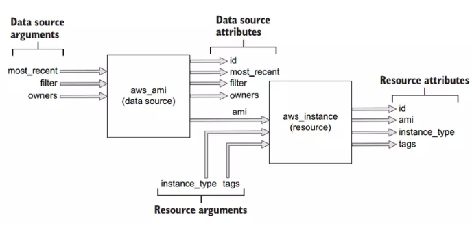

Vậy là ta đã biết cách viết file terraform ra sao và chạy những câu lệnh gì để terraform có thể tạo resource trên infrastructure cho ta. Và để hiểu rõ hơn về cách terraform tạo resource ra sao, ta sẽ đi nói qua về vòng đời của một resource.

Life cycle
==========

Sau khi làm qua ví dụ ở trên, thì các bạn có thể hiểu đơn giản Terraform là một công cụ để ta quản lý state thông qua file `terraform.tfstate` và thực hiện hành động CRUD lên các resource của một infrastructure nào đó, thông thường thì những resource của ta sẽ là cloud-based resources, nhưng terraform không giới hạn ở cloud mà là tất cả những resource nào mà ta có thể thực hiện CRUD lên nó, ta đều có thể quản lý thông qua terraform. Ở phần này thì ta sẽ dùng terraform để tạo một S3 (AWS Simple Cloud Storage) trên AWS để tìm hiểu về vòng đời của một resource.

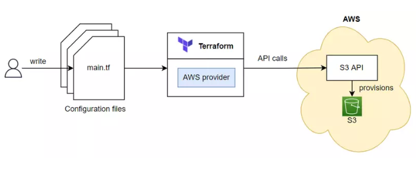

Life cycle function hooks
-------------------------

Tất cả các resource type của terraform đều implement một CRUD interface, trong CRUD interface này sẽ có các function hooks là Create(), Read(), Update(), Delete() và function này sẽ được thực thi nếu gặp đúng điều kiện phù hợp.

Còn data type thì nó implement một Read interface chỉ có một function hooks là Read().

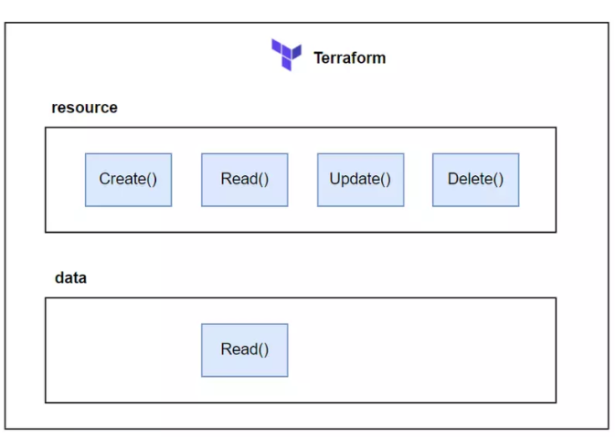

Create() sẽ được gọi trong quá trình tạo resource, Read() được gọi trong quá trình **plan**, Update() được gọi trong quá trình cập nhật resource, và Delete() được gọi trong quá trình xóa resource.

Ví dụ về S3 resource
--------------------

Bây giờ ta sẽ viết tf file để tạo S3 resource và nói qua từng function hooks trong nó. Tạo một wordspace tên là s3 và mở nó ra, tạo một file tên là `main.tf` với code như sau:

    provider "aws" {
      region = "us-west-2"
    }
    
    resource "aws_s3_bucket" "terraform-bucket" {
      bucket = "terraform-series-bucket"
    
      tags = {
        Name        = "Terraform Series"
      }
    }
    

Ở file trên ta dùng resource type là **aws\_s3\_bucket**, đây là resource type dùng để tạo S3 bucket trên AWS Cloud, trong đó trường bucket sẽ là tên bucket của ta. Sau khi viết xong thì ta chạy câu lệnh init để terraform tải aws provider xuống workspace hiện tại.

    $ terraform init
    

### Plan

Như đã nói ở trên, trước khi ta deploy resource, ta nên chạy `terraform plan` trước để xem những resource nào sẽ được tạo ra.

Và bên cạnh việc hiển thị cho ta xem những resource nào sẽ được tạo ra, thì nếu ta đã có resource rồi mà ta thay đổi giá trị gì trong file terraform, thì plan sẽ hiển thị cho ta là resource nào sẽ được cập nhật lại dựa theo state của resource trước đó đã được tạo ra.

Và nếu ta không thay đổi gì trong file terraform, thì khi ta chạy plan thì nó sẽ hiển thị là không có resource nào được thêm vào hoặc được cập nhật.

Quá trình plan sẽ in ra cho ta những kết quả rất hữu ích, chỉ cần đọc những gì quá trình plan in là ta sẽ biết resource trên infrastructure của ta sẽ như thế nào. Khi ta chạy câu lệnh plan, thì terraform sẽ thực hiện 3 bước chính như sau (nếu các bạn có ý định đi phỏng vấn thì đọc kĩ phần plan này nhé:

*   Đọc file configuration và state files: terraform sẽ đọc file configuration của bạn và state files (nếu có tồn tại) trước để lấy thông tin về resource đang ra sao.
*   Sau đó nó sẽ xác định những hành động nào sẽ được thực hiện: terraform sẽ thực hiện tình toán để xác định hành động nào sẽ được thực thi, có thể là Create(), Read(), Update(), Delete(), hoặc không làm gì cả (No-op).
*   Output plan

Biểu đồ minh họa của quá trình plan.

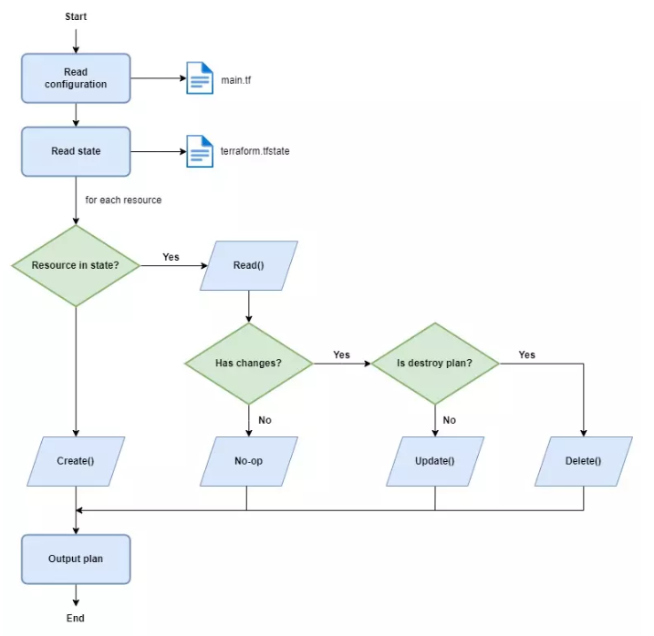

### Create S3 resource

Giờ ta sẽ chạy câu lệnh apply để tạo S3 trên AWS, ở trên thì khi ta chạy câu lệnh apply nó sẽ có thêm bước xác nhận và bắt ta nhập vào yes, nếu bạn muốn bỏ qua bước xác nhận thì khi chạy ta thêm vào -auto-approve.

    $ terraform apply -auto-approve
    Terraform used the selected providers to generate the following execution plan. Resource actions are indicated with the
    following symbols:
      + create
    
    Terraform will perform the following actions:
    
      # aws_s3_bucket.terraform-bucket will be created
      + resource "aws_s3_bucket" "terraform-bucket" {
      ...
      }
      
    Plan: 1 to add, 0 to change, 0 to destroy.
    aws_s3_bucket.terraform-bucket: Creating...
    aws_s3_bucket.terraform-bucket: Still creating... [10s elapsed]
    aws_s3_bucket.terraform-bucket: Creation complete after 15s [id=terraform-series-bucket]
    
    Apply complete! Resources: 1 added, 0 changed, 0 destroyed.
    

Như đã nói ở trên khi ta chạy xong câu lệnh apply, thì terraform sẽ tạo ra một file terraform.tfstate để lưu state lại, bạn bấm vào thì sẽ thấy nó lưu state của S3. Mở console web của AWS Cloud bạn sẽ thấy S3 bucket của ta đã được tạo ra với tên như ta đặt trong file config, của mình sẽ là terraform-series-bucket.

Làm sao terraform tạo được S3 resource này? Thì trong quá trình apply, terraform sẽ gọi Create() function của **aws\_s3\_bucket** resource type.

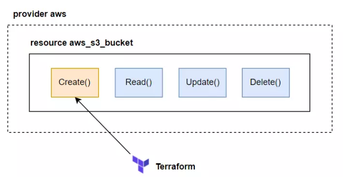

Thì trong Create() function của resource type aws\_s3\_bucket có chứa code mà nó sẽ gọi API lên AWS để thực hiện tạo S3 bucket, nên khi terraform gọi tới function này thì S3 resource sẽ được tạo ra.

Biểu đồ luồng create.

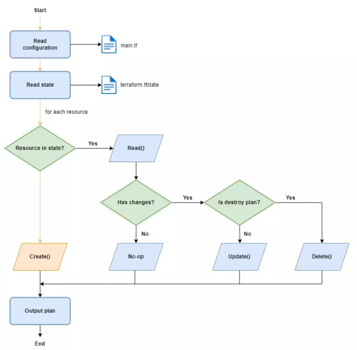

### No-op

Khi ta đã tạo resource xong, nếu ta không sửa gì cả, thì khi ta thực thi plan terraform sẽ đi qua bước No-op trong biểu đồ phía trên. Như để đây nếu ta chạy terraform plan thì đầu tiên terraform sẽ đọc file config của ta, sau đó nó phát hiện có state file, nó đọc state file. Kiểm tra S3 mà ta viết trong file config có tồn tại trong state file hay không, nếu có terraform sẽ thực thi Read() function của resource type aws\_s3\_bucket.

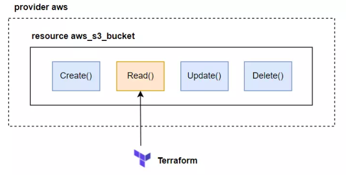

Read() sẽ chứa code mà gọi lên AWS để lấy state của S3 hiện tại trên AWS, và so sánh với state của S3 trong state file. Nếu không có gì thay đổi, thì Read() sẽ return về kết quả là không có gì thay đổi. Và terraform sẽ không thực thi hành động nào cả.

Biểu đồ luồng no-op.

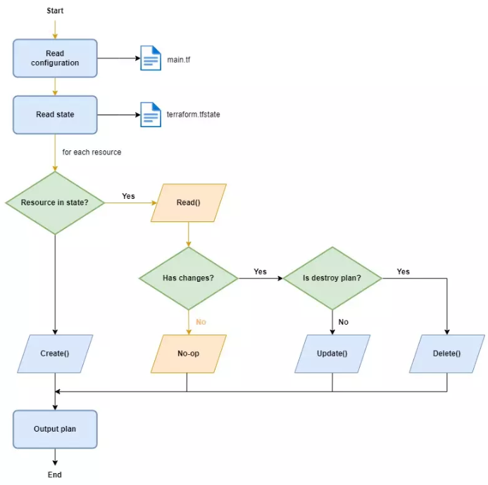

### Update S3 resource

Bây giờ ta sẽ sửa config trong terraform file, trong terraform không có câu lệnh update, ta chỉ cần sửa config file và chạy lại câu lệnh apply, terrform sẽ tự xác định dựa vào resource state để thực hện update cho ta. Ta sửa lại bucket name của s3.

    provider "aws" {
      region = "us-west-2"
    }
    
    resource "aws_s3_bucket" "terraform-bucket" {
      bucket = "terraform-series-bucket-update"
    
      tags = {
        Name        = "Terraform Series"
      }
    }
    

Sau đó ta chạy câu lệnh plan lại.

    $ terraform plan
    aws_s3_bucket.terraform-bucket: Refreshing state... [id=terraform-series-bucket]
    
    Terraform used the selected providers to generate the following execution plan. Resource actions are indicated with the
    following symbols:
    -/+ destroy and then create replacement
    
    Terraform will perform the following actions:
    
      # aws_s3_bucket.terraform-bucket must be replaced
    -/+ resource "aws_s3_bucket" "terraform-bucket" {
          + acceleration_status         = (known after apply)
          ~ arn                         = "arn:aws:s3:::terraform-series-bucket" -> (known after apply)
          ~ bucket                      = "terraform-series-bucket" -> "terraform-series-bucket-update" # forces replacement
          ~ bucket_domain_name          = "terraform-series-bucket.s3.amazonaws.com" -> (known after apply)
          ~ bucket_regional_domain_name = "terraform-series-bucket.s3.us-west-2.amazonaws.com" -> (known after apply)
          ~ hosted_zone_id              = "Z3BJ6K6RIION7M" -> (known after apply)
          ~ id                          = "terraform-series-bucket" -> (known after apply)
          ~ region                      = "us-west-2" -> (known after apply)
          ~ request_payer               = "BucketOwner" -> (known after apply)
            tags                        = {
                "Name" = "Terraform Series"
            }
          + website_domain              = (known after apply)
          + website_endpoint            = (known after apply)
            # (3 unchanged attributes hidden)
    
          ~ versioning {
              ~ enabled    = false -> (known after apply)
              ~ mfa_delete = false -> (known after apply)
            }
        }
    
    Plan: 1 to add, 0 to change, 1 to destroy.
    
    ───────────────────────────────────────────────────────────────────────────────────────────────────────────────────────────
    
    Note: You didn't use the -out option to save this plan, so Terraform can't guarantee to take exactly these actions if you
    run "terraform apply" now.
    

Bạn sẽ thấy là S3 bucket của ta sẽ được terraform update lại bằng cách thực hiện `destroy and then create replacement`. Nghĩa là trước tiên terraform sẽ xóa S3 resource cũ, sau đó nó sẽ tạo lại resource S3 mới với tên bucket khác. Tại sao lại như vậy thì trường bucket ở trong resource type aws\_s3\_bucket là một thuộc tính **force new**.

Trong terraform, resource sẽ có hai loại thuộc tính (attribute) là force new với normal update:

*   Force new attribute: resource sẽ được re-create (xóa resource cũ trước và tạo ra lại resouce mới).

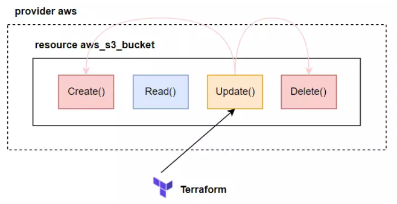

*   Normal update attribute: resource được update bình thường, không cần phải xóa resouce cũ.

Một thuộc tính sẽ thuộc loại nào thì tùy thuộc vào provider và resource type. Ở trên vì ta thay đổi thuộc tính force new của aws\_s3\_bucket nên nó sẽ được re-create. Vì việc xóa và tạo lại sẽ gặp rất nhiều vấn đề, nên ta cần chạy câu lệnh plan để xác định tại sao resource của ta lại như vậy, đây là tác dụng của việc chạy câu lệnh plan trước, nhớ là luôn luôn nên chạy plan trước khi deploy.

Vì S3 bucket của ta mới tạo và không có gì trong đó hết, ta cứ chạy terraform apply để nó update bình thường.

    $ terraform apply -auto-approve
    aws_s3_bucket.terraform-bucket: Refreshing state... [id=terraform-series-bucket]
    
    Terraform used the selected providers to generate the following execution plan. Resource actions are indicated with the
    following symbols:
    -/+ destroy and then create replacement
    
    Terraform will perform the following actions:
    
     # aws_s3_bucket.terraform-bucket must be replaced
    -/+ resource "aws_s3_bucket" "terraform-bucket" {
         + acceleration_status         = (known after apply)
         ~ arn                         = "arn:aws:s3:::terraform-series-bucket" -> (known after apply)
         ~ bucket                      = "terraform-series-bucket" -> "terraform-series-bucket-update" # forces replacement
         ~ bucket_regional_domain_name = "terraform-series-bucket.s3.us-west-2.amazonaws.com" -> (known after apply)
         ~ hosted_zone_id              = "Z3BJ6K6RIION7M" -> (known after apply)
         ~ id                          = "terraform-series-bucket" -> (known after apply)
         ~ region                      = "us-west-2" -> (known after apply)
           tags                        = {
               "Name" = "Terraform Series"
           }
         + website_domain              = (known after apply)
         + website_endpoint            = (known after apply)
           # (3 unchanged attributes hidden)
    
         ~ versioning {
             ~ enabled    = false -> (known after apply)
             ~ mfa_delete = false -> (known after apply)
           }
       }
    
    Plan: 1 to add, 0 to change, 1 to destroy.
    aws_s3_bucket.terraform-bucket: Destroying... [id=terraform-series-bucket]
    aws_s3_bucket.terraform-bucket: Destruction complete after 1s
    aws_s3_bucket.terraform-bucket: Creating...
    aws_s3_bucket.terraform-bucket: Still creating... [10s elapsed]
    aws_s3_bucket.terraform-bucket: Creation complete after 15s [id=terraform-series-bucket-update]
    
    Apply complete! Resources: 1 added, 0 changed, 1 destroyed.
    

Sau khi chạy xong bạn sẽ thấy S3 bucket với tên mới đã được tạo ta.

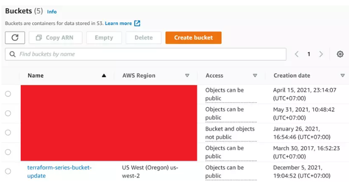

Biểu đồ của luồng update.
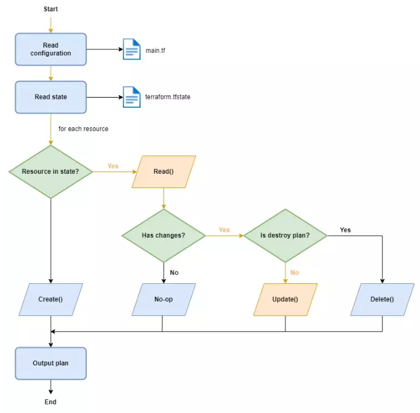
### Delete S3 resource

Ta xóa resource bằng câu lệnh destory. Giống với apply, ta có thể bỏ qua bước xác nhận bằng cách truyền thêm -auto-approve.

    $ terraform destroy -auto-approve
    aws_s3_bucket.terraform-bucket: Refreshing state... [id=terraform-series-bucket-update]
    
    Terraform used the selected providers to generate the following execution plan. Resource actions are indicated with the
    following symbols:
     - destroy
    
    Terraform will perform the following actions:
    
     # aws_s3_bucket.terraform-bucket will be destroyed
     - resource "aws_s3_bucket" "terraform-bucket" {
         - acl                         = "private" -> null
         - arn                         = "arn:aws:s3:::terraform-series-bucket-update" -> null
         - bucket                      = "terraform-series-bucket-update" -> null
         - bucket_domain_name          = "terraform-series-bucket-update.s3.amazonaws.com" -> null
         - bucket_regional_domain_name = "terraform-series-bucket-update.s3.us-west-2.amazonaws.com" -> null
         - force_destroy               = false -> null
         - hosted_zone_id              = "Z3BJ6K6RIION7M" -> null
         - id                          = "terraform-series-bucket-update" -> null
         - region                      = "us-west-2" -> null
         - request_payer               = "BucketOwner" -> null
         - tags                        = {
             - "Name" = "Terraform Series"
           } -> null
         - tags_all                    = {
             - "Name" = "Terraform Series"
           } -> null
    
         - versioning {
             - enabled    = false -> null
             - mfa_delete = false -> null
           }
       }
    
    Plan: 0 to add, 0 to change, 1 to destroy.
    aws_s3_bucket.terraform-bucket: Destroying... [id=terraform-series-bucket-update]
    aws_s3_bucket.terraform-bucket: Destruction complete after 1s
    
    Destroy complete! Resources: 1 destroyed.
    

Khi ta chạy câu lệnh destroy, thì trước đó nó sẽ thực hiện plan, đọc trong state file của ta xem coi có resource đó không, nếu có thì nó sẽ thực hiện Delete() function của resource type aws\_s3\_bucket.

Biểu đồ luồng delete.
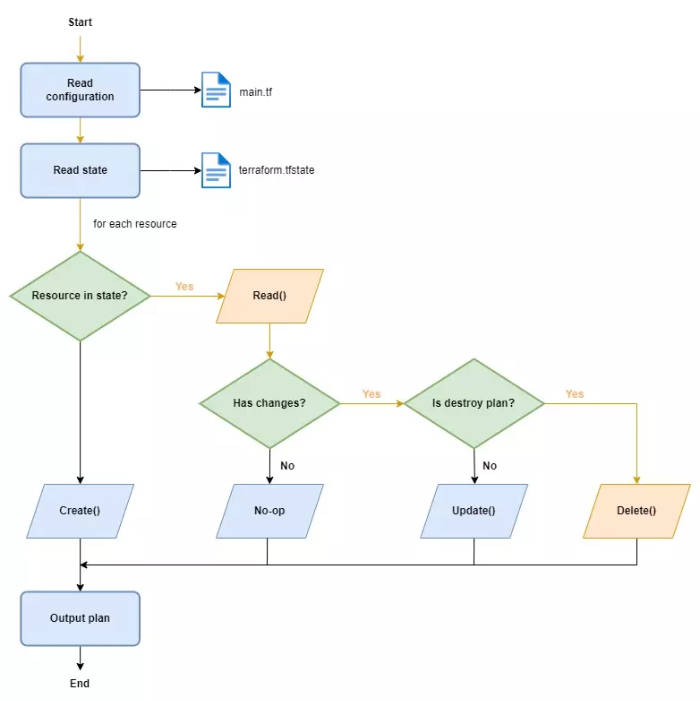
Sau khi ta chạy câu lệnh destroy xong, thì workspace của ta sẽ như sau:

    .
    ├── main.tf
    ├── terraform.tfstate
    └── terraform.tfstate.backup
    

Ta thấy có thêm file `terraform.tfstate.backup`, file backup này là file được tạo ra từ state file trước đó, chủ yếu để bạn xem state trước đó của các resource của ta ra sao.

> Khi ta xóa toàn bộ config trong file terraform và chạy câu lệnh apply thì tương ứng như ta chạy câu lệnh terraform destroy.

Ok, ta đã nói xong về life cycle của resource trong terraform. Giờ ta sẽ bàn về một vấn để rất hay xảy ra, là **nếu mà có ai đó thay đổi config của resource chúng ta bên ngoài terraform thì sao?** Terraform sẽ xử lý việc đó như thế nào?

Resource drift
==============

Resource drift là vấn đề khi config resource của ta bị thay đổi bên ngoài terraform, với AWS thì có thể là do ai đó dùng Web Console của AWS để thay đổi config gì đó của resource mà được ta deploy bằng terraform. Dùng lại ví dụ ở trên, ta tạo lại S3.

    provider "aws" {
      region = "us-west-2"
    }
    
    resource "aws_s3_bucket" "terraform-bucket" {
      bucket = "terraform-series-bucket-update"
    
      tags = {
        Name        = "Terraform Series"
      }
    }
    

    $ terraform apply -auto-approve
    ...
    Plan: 1 to add, 0 to change, 0 to destroy.
    aws_s3_bucket.terraform-bucket: Creating...
    aws_s3_bucket.terraform-bucket: Still creating... [10s elapsed]
    aws_s3_bucket.terraform-bucket: Creation complete after 15s [id=terraform-series-bucket-update]
    
    Apply complete! Resources: 1 added, 0 changed, 0 destroyed.
    

Sau đó ta login lên Web Console của AWS, ta sửa lại trường tags của S3 bucket.
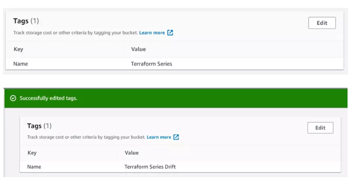

Thì khi ta sửa như vậy, thì terraform không có tự động phát hiện và update lại file config terraform của ta nhé, nó không có thần kì như vậy. Mà khi ta chạy câu lệnh apply, nó sẽ phát hiện thay đổi và update lại trường tags mà ta thay đổi ngoài terraform thành giống với tags ta viết trong file config. Bạn chạy câu lệnh plan trước để xem.

    $ terraform plan
    aws_s3_bucket.terraform-bucket: Refreshing state... [id=terraform-series-bucket-update]
    
    Note: Objects have changed outside of Terraform
    
    Terraform detected the following changes made outside of Terraform since the last "terraform apply":
    
      # aws_s3_bucket.terraform-bucket has been changed
      ~ resource "aws_s3_bucket" "terraform-bucket" {
            id                          = "terraform-series-bucket-update"
          ~ tags                        = {
              ~ "Name" = "Terraform Series" -> "Terraform Series Drift"
            }
          ~ tags_all                    = {
              ~ "Name" = "Terraform Series" -> "Terraform Series Drift"
            }
            # (9 unchanged attributes hidden)
    
            # (1 unchanged block hidden)
        }
    
    Unless you have made equivalent changes to your configuration, or ignored the relevant attributes using ignore_changes, the
    following plan may include actions to undo or respond to these changes.
    
    ───────────────────────────────────────────────────────────────────────────────────────────────────────────────────────────
    
    Terraform used the selected providers to generate the following execution plan. Resource actions are indicated with the
    following symbols:
      ~ update in-place
    
    Terraform will perform the following actions:
    
      # aws_s3_bucket.terraform-bucket will be updated in-place
      ~ resource "aws_s3_bucket" "terraform-bucket" {
            id                          = "terraform-series-bucket-update"
          ~ tags                        = {
              ~ "Name" = "Terraform Series Drift" -> "Terraform Series"
            }
          ~ tags_all                    = {
              ~ "Name" = "Terraform Series Drift" -> "Terraform Series"
            }
            # (9 unchanged attributes hidden)
    
            # (1 unchanged block hidden)
        }
    
    Plan: 0 to add, 1 to change, 0 to destroy.
    
    ───────────────────────────────────────────────────────────────────────────────────────────────────────────────────────────
    
    Note: You didn't use the -out option to save this plan, so Terraform can't guarantee to take exactly these actions if you
    run "terraform apply" now.
    

Như bạn thấy, terraform sẽ phát hiện được resource đã bị thay đổi bên ngoài terraform, nó in ra câu **Note: Objects have changed outside of Terraform** để báo ta biết việc đó. Và tùy thuộc vào thuộc tính mà ta thay đổi bên ngoài terraform là force new hay normal update thì terraform sẽ thực hiện re-create hay update bình thường cho ta.

Vậy còn nếu ta có một resource đang chạy rất nhiều thứ quan trọng, như là database chẳng hạng, thì khi ta thay đổi một thuộc tính là force new thì DB của ta sẽ bị xóa đi và tạo lại cái mới hay sao? Làm sao ta chấp nhận việc đó được? Để giải quyết vấn đề này thì mình sẽ viết một bài khác để giải thích nhé.

Giờ ta chạy lại câu lệnh apply thì ta sẽ thấy S3 tags của ta được update lại như cũ.

    $ terraform apply -auto-approve
    ...
    Plan: 0 to add, 1 to change, 0 to destroy.
    aws_s3_bucket.terraform-bucket: Modifying... [id=terraform-series-bucket-update]
    aws_s3_bucket.terraform-bucket: Still modifying... [id=terraform-series-bucket-update, 10s elapsed]
    aws_s3_bucket.terraform-bucket: Modifications complete after 13s [id=terraform-series-bucket-update]
    
    Apply complete! Resources: 0 added, 1 changed, 0 destroyed.

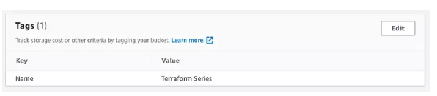    

Kết luận
========

Vậy là ta đã tìm hiểu xong về life cycle của resource trong terraform và terraform sẽ thực hiện việc tạo, cập nhật và xóa resource thế nào. Như bạn thấy thì terraform đơn giản chỉ là một state management tool và thực hiện CRUD operations mà thôi. Bài tiếp theo ta sẽ tìm hiểu về Functional programming bên trong terraform