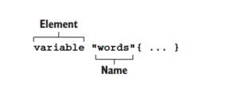
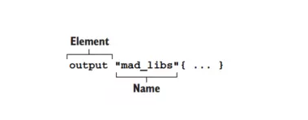
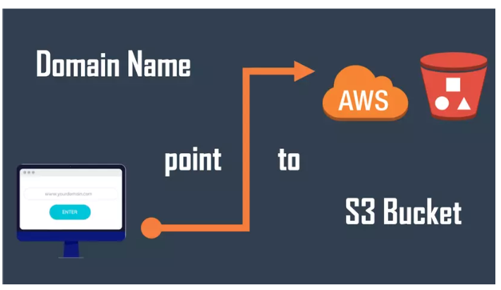

Terraform hỗ trợ ta lập trình theo cách functional programming, và ta sẽ nói qua cách sử dụng các function trong terraform, expressions xài ra sao, ...

Provisioning EC2
----------------

Ta sẽ làm ví dụ về EC2 để tìm hiểu về các khái niệm trên. Tạo một file tên là `main.tf`

    provider "aws" {
      region = "us-west-2"
    }
    
    data "aws_ami" "ubuntu" {
      most_recent = true
    
      filter {
        name   = "name"
        values = ["ubuntu/images/hvm-ssd/ubuntu-focal-20.04-amd64-server-*"]
      }
    
      owners = ["099720109477"]
    }
    
    resource "aws_instance" "hello" {
      ami           = data.aws_ami.ubuntu.id
      instance_type = "t2.micro"
    }
    

Chạy `terraform init` và `terraform apply`, sau đó lên AWS ta sẽ thấy EC2 của ta. Với đoạn code trên thì EC2 của ta luôn luôn có instance\_type là t2.micro, và nếu ta muốn tạo lại EC2 mà sẽ có instance\_type khác mạnh hơn thì làm sao? Ta sẽ sửa lại code trong file terraform? Vậy thì không linh hoạt cho lắm, mà thay vào đó ta sẽ sử dụng variable để làm việc này.

### Input Variables

Ta có thể định nghĩa variable bên trong terraform, với cú pháp như sau.
 

Ta sẽ dùng variable block để khai báo variable, và theo sau nó là tên của variable đó. Ở ví dụ trên, ta tạo thêm một file nữa với tên là `variable.tf` (này bạn đặt tên gì cũng được nha) để khai báo biến của ta.

    variable "instance_type" {
      type = string
      description = "Instance type of the EC2"
    }
    

Thuộc tính là type để chỉ định type của biến đó, thuộc tính description dùng để ghi lại mô tả cho người đọc biến đó có ý nghĩa gì. **Chỉ có thuộc tính type là bắt buộc phải khai báo**. Trong terraform thì một biến sẽ có các type sau đây:

*   Basic type: string, number, bool
*   Complex type: list(), set(), map(), object(), tuple()

> Trong terraform, type number và type bool sẽ được convert thành type string khi cần thiết. Nghĩa là 1 sẽ thành "1", true sẽ thành "true"

Để truy cập được giá trị của variable thì ta sẽ dùng theo cú pháp sau `var.<VARIABLE_NAME>`, cập nhật lại file `main.tf`

    provider "aws" {
      region = "us-west-2"
    }
    
    data "aws_ami" "ubuntu" {
      most_recent = true
    
      filter {
        name   = "name"
        values = ["ubuntu/images/hvm-ssd/ubuntu-focal-20.04-amd64-server-*"]
      }
    
      owners = ["099720109477"]
    }
    
    resource "aws_instance" "hello" {
      ami           = data.aws_ami.ubuntu.id
      instance_type = var.instance_type # change here
    }
    

Ở thuộc tính instance\_type thay vì gán cứng thì bây giờ ta sẽ dùng biến **var.instance\_type**.

### Gán giá trị cho variable

Để gán giá trị cho biến, ta sẽ tạo một file tên là terraform.tfvars

    instance_type = "t2.micro"
    

Khi ta chạy `terraform apply` thì file terraform.tfvars sẽ được terraform sử dụng mặc định để load giá trị cho biến, nếu ta không muốn dùng mặc định, thì khi chạy câu lệnh apply ta thêm vào option là -var-file nữa. Tạo một file tên là production.tfvars

    instance_type = "t3.small"
    

Khi chạy CI/CD cho production, ta chỉ định file variable như sau:

    terraform apply -var-file="production.tfvars"
    

Bây giờ thì giá trị instance\_type của ta sẽ linh hoạt hơn nhiều.

### Validating variables

Ta cũng có thể định nghĩa biến này chỉ có thể được gán những giá trị mà ta cho phép bằng cách sử dùng thuộc tính validating, như sau:

    variable "instance_type" {
      type = string
      description = "Instance type of the EC2"
    
      validation {
        condition = contains(["t2.micro", "t3.small"], var.instance_type)
        error_message = "Value not allow."
      }
    }
    

Ở file trên ta sẽ dùng function contains để kiểm tra giá trị của biến instance\_type này chỉ được nằm trong mảng array ta cho phép, nếu không thì khi ta chạy câu lệnh apply bạn sẽ thấy lỗi là ở trường error\_message được in ra. Sửa lại file terraform.tfvars

    instance_type = "t3.micro"
    

Chạy terraform apply.

    $ terraform apply
    ╷
    │ Error: Invalid value for variable
    │ 
    │   on variable.tf line 1:
    │    1: variable "instance_type" {
    │ 
    │ Value not allow.
    │ 
    │ This was checked by the validation rule at variable.tf:5,3-13.
    ╵
    

Sử dụng validating để kiểm soát giá trị của biến mà bạn muốn. Sửa lại file terraform.tfvars như cũ nhé. Thông thường khi tạo EC2 xong, ta sẽ muốn xem địa chỉ IP của nó, để làm được việc đó thì ta sử dụng output block.

### Output

Giá trị của output block sẽ được in ra terminal, cú pháp của output như sau.

Để in được giá trị public IP của EC2, ta thêm vào file `main.tf` đoạn code sau:

    ...
    
    output "ec2" {
      value = {
        public_ip = aws_instance.hello.public_ip
      }
    }
    

Bạn chạy lại câu lệnh apply, ta sẽ thấy giá trị IP của EC2 được in ra terminal.

    $ terraform apply -auto-approve
    ...
    
    Apply complete! Resources: 1 added, 0 changed, 0 destroyed.
    
    Outputs:
    
    ec2 = {
      "public_ip" = "52.36.124.230"
    }
    

Oke, bây giờ thì ta đã biết cách sử dụng varibale và output. Tiếp theo, nếu ta muốn thêm một EC2 nữa thì sao? Trong file `main.tf` ta sẽ copy ra thêm một EC2 nữa, như sau:

    provider "aws" {
      region = "us-west-2"
    }
    
    data "aws_ami" "ubuntu" {
      most_recent = true
    
      filter {
        name   = "name"
        values = ["ubuntu/images/hvm-ssd/ubuntu-focal-20.04-amd64-server-*"]
      }
    
      owners = ["099720109477"]
    }
    
    resource "aws_instance" "hello1" {
      ami           = data.aws_ami.ubuntu.id
      instance_type = var.instance_type
    }
    
    resource "aws_instance" "hello2" {
      ami           = data.aws_ami.ubuntu.id
      instance_type = var.instance_type
    }
    
    output "ec2" {
      value = {
        public_ip1 = aws_instance.hello1.public_ip
        public_ip2 = aws_instance.hello2.public_ip
      }
    }
    

Ta sẽ thêm một resource block cho EC2 thứ hai, và ở phần output, ta cập nhật lại để nó có thể in ra được IP của hai con EC2. Mọi thứ đều không có gì phức tạp hết, nhưng nếu giờ ta muốn 100 con EC2 thì sao? Ta có thể copy ra 100 resource block, nhưng không ai làm vậy 😂, mà ta sẽ sử dụng count parameter.

### Count parameter

Count là một **meta argument**, là một thuộc tính trong terraform chứ không phải của resource type thuộc provider, ở bài 1 ta đã nói resource type block chỉ có chứa các thuộc tính mà provider cung cấp cho, còn meta argument là thuộc tính của terraform => nghĩa là ta có thể sử dụng nó ở bất kì resource block nào. Cập nhật lại file `main.tf` mà sẽ tạo ra 5 EC2 như sau:

    provider "aws" {
      region = "us-west-2"
    }
    
    data "aws_ami" "ubuntu" {
      most_recent = true
    
      filter {
        name   = "name"
        values = ["ubuntu/images/hvm-ssd/ubuntu-focal-20.04-amd64-server-*"]
      }
    
      owners = ["099720109477"]
    }
    
    resource "aws_instance" "hello" {
      count         = 5
      ami           = data.aws_ami.ubuntu.id
      instance_type = var.instance_type
    }
    
    output "ec2" {
      value = {
        public_ip1 = aws_instance.hello[0].public_ip
        public_ip2 = aws_instance.hello[1].public_ip
        public_ip3 = aws_instance.hello[2].public_ip
        public_ip4 = aws_instance.hello[3].public_ip
        public_ip5 = aws_instance.hello[4].public_ip
      }
    }
    

Bây giờ thì khi ta chạy apply, terraform sẽ tạo ra cho ta 5 EC2. Bạn sẽ để ý là ở phần output, để truy cập được resource, thì ta sẽ dùng thêm dấu `[]` và giá trị index của resource. Bình thường, để truy cập được resource, ta dùng theo cú pháp `<RESOURCE TYPE>.<NAME>`, nhưng khi ta dùng count thì ta sẽ truy cập resource theo cú pháp sau `<RESOURCE TYPE>.<NAME>[index]`.

Bây giờ ta đã giải quyết được vấn đề copy resource ra khi cần tạo nó với số lượng nhiều hơn, nhưng ở phần output, ta vẫn phải ghi ra từng resource riêng lẻ. Ta sẽ giải quyết nó bằng cách sử dụng for expressions.

### For expressions

For cho phép ta duyệt qua một list, cú pháp của lệnh for như sau:

    for <value> in <list> : <return value>
    

Ví dụ dùng for:

*   Tạo ra một array mới với giá trị của array mới sẽ được upper: `[for s in var.words : upper(s)]`
*   Tạo ra một object mới với value của object được upper: `{ for k, v in var.words : k => upper(s) }`

Ta sẽ dùng for để rút gọn phần output IP của EC2. Cập nhật lại file `main.tf`

    ...
    
    resource "aws_instance" "hello" {
      count         = 5
      ami           = data.aws_ami.ubuntu.id
      instance_type = var.instance_type
    }
    
    output "ec2" {
      value = {
        public_ip = [ for v in aws_instance.hello : v.public_ip ]
      }
    }
    

Phần output trên sẽ in ra cho ta giá trị public\_ip là một mảng IP của tất cả EC2 được tạo ra. Còn nếu bạn muốn in output ra theo kiểu `{ public_ip1: <value>, public_ip2: <value> }` thì ta có thể dùng format function.

### Format function

Hàm format sẽ giúp ta nối chuỗi theo dạng ta muốn, cập nhật output lại như sau:

    ...
    
    resource "aws_instance" "hello" {
      count         = 5
      ami           = data.aws_ami.ubuntu.id
      instance_type = var.instance_type
    }
    
    output "ec2" {
      value = { for i, v in aws_instance.hello : format("public_ip%d", i + 1) => v.public_ip }
    }
    

Khi bạn terraform plan để kiểm tra, sẽ thấy output lúc này sẽ là dạng `{ public_ip1: <value>, public_ip2: <value> }`.

    $ terraform plan
    ...
    Changes to Outputs:
      + ec2 = {
          + public_ip1 = (known after apply)
          + public_ip2 = (known after apply)
          + public_ip3 = (known after apply)
          + public_ip4 = (known after apply)
          + public_ip5 = (known after apply)
        }
    
    ────────────────────────────────────────────────────────────────────────────────────────────────────────────────────────────
    
    Note: You didn't use the -out option to save this plan, so Terraform can't guarantee to take exactly these actions if you
    run "terraform apply" now.
    

Tới đây thì ta đã biết được cách xài một số cú pháp đơn giản, tiếp theo mình sẽ chuyển sang ví dụ về S3 để nói thêm về một số function hay được sử dụng nữa.

Provisioning S3
---------------

Ở ví dụ này ta sẽ tạo một S3 bucket để host một static website.

Tạo folder mới và tạo một file `main.tf`

    provider "aws" {
      region = "us-west-2"
    }
    
    resource "aws_s3_bucket" "static" {
      bucket = "terraform-series-bai3"
      acl    = "public-read"
      policy = <<POLICY
      {
        "Version": "2012-10-17",
        "Statement": [
          {
            "Sid": "PublicReadGetObject",
            "Effect": "Allow",
            "Principal": "*",
            "Action": [
              "s3:GetObject"
            ],
            "Resource": [
              "arn:aws:s3:::terraform-series-bai3/*"
            ]
          }
        ]
      }
      POLICY
    
      website {
        index_document = "index.html"
        error_document = "error.html"
      }
    }
    

Chạy `terraform init` và `terraform apply`, sau đó bạn sẽ thấy S3 bucket của ta trên AWS.

Ở file trên bạn sẽ thấy là phần policy nó hơi dài, và nó là dạng chuỗi json, nên config file của ta hơi khó nhìn, ta có thể tách phần policy ra một file json riêng, và dùng function trong terrafrom để import file policy đó vào config file của ta.

### File function

File function sẽ giúp ta tải nội dung của một file nào đó vào bên trong config file của terraform. Tạo một file tên là s3\_static\_policy.json và copy đoạn json trên vào.

    {
      "Version": "2012-10-17",
      "Statement": [
        {
          "Sid": "PublicReadGetObject",
          "Effect": "Allow",
          "Principal": "*",
          "Action": [
            "s3:GetObject"
          ],
          "Resource": [
            "arn:aws:s3:::terraform-series-bai3/*"
          ]
        }
      ]
    }
    

Cập nhật lại `main.tf`

    provider "aws" {
      region = "us-west-2"
    }
    
    resource "aws_s3_bucket" "static" {
      bucket = "terraform-series-bai3"
      acl    = "public-read"
      policy = file("s3_static_policy.json")
    
      website {
        index_document = "index.html"
        error_document = "error.html"
      }
    }
    

Như bạn thấy thì khi để policy vào một file khác và dùng file function import vào, thì file terraform của ta nhìn gọn hơn nhiều. Tiếp theo ta sẽ tiến hành upload file lên s3 bucket và truy vập vào URL thì ta sẽ thấy được trang web của ta. Trang web mà ta host sẽ có giao diện như sau.

Các bạn clone source code ở đây nhé [https://github.com/hoalongnatsu/static-web.git](https://github.com/hoalongnatsu/static-web.git), sau khi clone xong thì nhớ xóa file .git đi.

    rm -rf static-web/.git
    

Thư mục của ta hiện tại sẽ như sau.

    .
    ├── main.tf
    ├── s3_static_policy.json
    ├── static-web
    │   ├── README.md
    │   ├── article-details.html
    ...
    ├── terraform.tfstate
    

Để upload file lên s3 thì ta sẽ dùng resource type là **aws\_s3\_bucket\_object**. Cập nhật lại file `main.tf`

    provider "aws" {
      region = "us-west-2"
    }
    
    resource "aws_s3_bucket" "static" {
      bucket = "terraform-series-bai3"
      acl    = "public-read"
      policy = file("s3_static_policy.json")
    
      website {
        index_document = "index.html"
        error_document = "error.html"
      }
    }
    
    locals {
      mime_types = {
        html  = "text/html"
        css   = "text/css"
        ttf   = "font/ttf"
        woff  = "font/woff"
        woff2 = "font/woff2"
        js    = "application/javascript"
        map   = "application/javascript"
        json  = "application/json"
        jpg   = "image/jpeg"
        png   = "image/png"
        svg   = "image/svg+xml"
        eot   = "application/vnd.ms-fontobject"
      }
    }
    
    resource "aws_s3_bucket_object" "object" {
      for_each = fileset(path.module, "static-web/**/*")
      bucket = aws_s3_bucket.static.id
      key    = replace(each.value, "static-web", "")
      source = each.value
      etag         = filemd5("${each.value}")
      content_type = lookup(local.mime_types, split(".", each.value)[length(split(".", each.value)) - 1])
    }
    

Tạm thời thì các bạn chưa cần hiểu code phần aws\_s3\_bucket\_object, phần mình muốn giới thiệu ở đây là fileset function, thay vì chỉ tải một file, thì fileset sẽ tải toàn bộ file trong thư mục đó lên theo dạng set.

### Fileset function

Ví dụ ta có thư mục như sau

    .
    ├── index.html
    ├── index.css
    

Thì khi ta dùng hàm `fileset(path.module, "*")` ta sẽ có được data set như sau:

    {
      "index.html": "index.html",
      "index.css" : "index.css"
    }
    

Với giá trị key và value là tên của file.

### Local values

Bạn sẽ thấy có một block nữa tên là locals, đây là block giúp ta khai báo một giá trị local trong file terraform và có thể sử dụng lại được nhiều lần. Cú pháp như sau:

Không giống như variable block, ta cần khai báo type, thì locals block ta sẽ gán thẳng giá trị cho nó. Ví dụ như sau:

    locals {
      one = 1
      two = 2
      name = "max"
      flag = true
    }
    

Để truy cập giá trị local thì ta dùng cú pháp `local.<KEY>`. Oke, sau khi chạy câu lệnh `terraform apply` lại, bạn truy cập trang web với url là `http://terraform-series-bai3.s3-website-us-west-2.amazonaws.com/` thì sẽ thấy được trang web của ta 😁. Nếu bạn đặt tên S3 bucket khác thì URL trên sẽ khác nhé.

Kết luận
--------

Vậy là ta đã tìm hiểu xong về một số cách đơn giản để lập trình được trong terraform. Sử dụng varibale để chứa biến, sử dụng output để show giá trị ra terminal, sử dụng for để duyệt qua mảng, sử dụng locals để lưu giá trị và sử dụng lại nhiều lần.